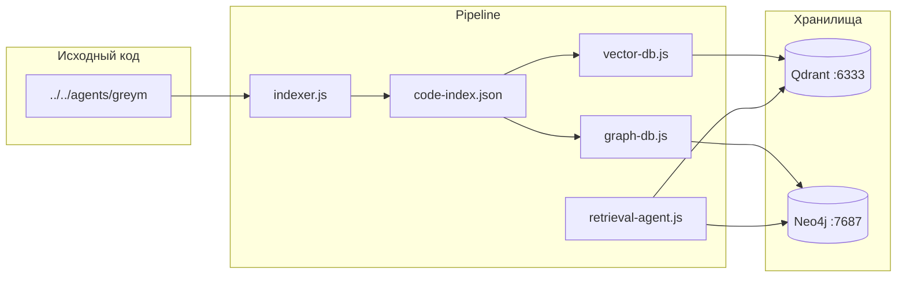

# ast-retrieval

Система индексации и поиска по кодовой базе на основе AST, векторного поиска (Qdrant) и графа вызовов функций (Neo4j).

Проект сканирует TypeScript/JavaScript-файлы, извлекает структуру (классы, функции, методы, вызовы) и загружает данные в две базы:

- **Qdrant** — семантический поиск по содержимому файлов через OpenAI embeddings
- **Neo4j** — граф связей «функция → вызывает → функция»

---

## Архитектура



### Поток данных

1. `indexer.js` парсит AST и пишет `code-index.json`
2. `vector-db.js` читает индекс, создаёт embeddings и загружает в Qdrant
3. `graph-db.js` читает индекс и строит граф в Neo4j
4. `retrieval-agent.js` объединяет векторный и графовый поиск по запросу

---

## Структура проекта

```
ast-retrieval/
├── doc/
│   └── DOC.md              # эта документация
├── indexer.js              # AST-индексатор + watch-режим
├── vector-db.js            # загрузка векторов в Qdrant
├── graph-db.js             # построение графа в Neo4j
├── retrieval-agent.js      # гибридный retrieval API
├── code-index.json         # промежуточный индекс (генерируется)
├── docker-compose.yml      # Neo4j + Qdrant
├── package.json
└── .env                    # OPENAI_API_KEY (не коммитить)
```

---

## Требования

- **Node.js** 18+ (протестировано на 22.x)
- **Docker** и **Docker Compose**
- **OpenAI API key** — для генерации embeddings (`text-embedding-3-small`)

---

## Быстрый старт

### 1. Установка зависимостей

```bash
npm install
```

### 2. Переменные окружения

Создайте файл `.env` в корне проекта:

```env
OPENAI_API_KEY=sk-...
```

Переменная используется в `vector-db.js` и `retrieval-agent.js`.

### 3. Запуск инфраструктуры

```bash
docker compose up -d
```

| Сервис | Порт | Назначение |
|--------|------|------------|
| Qdrant | 6333 | REST API и dashboard |
| Neo4j  | 7474 | Web-браузер |
| Neo4j  | 7687 | Bolt-протокол |

**Учётные данные Neo4j:** `neo4j` / `password` (см. `docker-compose.yml`).

### 4. Полный pipeline

```bash
# Шаг 1: индексация исходников
node indexer.js

# Шаг 2: векторная база (требует OPENAI_API_KEY и Qdrant)
node vector-db.js

# Шаг 3: граф вызовов (требует Neo4j)
node graph-db.js
```

После успешного выполнения:

```
✅ ГОТОВО! Файлов: N | Вызовов: M
✅ Qdrant вектора готовы
✅ Neo4j граф построен
```

---

## Модули

### indexer.js

AST-индексатор на базе `@babel/parser` и `@babel/traverse`.

**Индексируемый проект** задаётся константой:

```js
const PROJECT_ROOT = '../../agents/greym';
```

**Поддерживаемые расширения:** `.js`, `.ts`, `.jsx`, `.tsx`

**Игнорируются:** `node_modules/**`, `dist/**`, `.git/**`

#### Что извлекается из каждого файла

| Поле | Описание |
|------|----------|
| `classes` | Имена объявленных классов |
| `functions` | Имена функций (declaration, arrow, export) |
| `methods` | Методы по классам `{ ClassName: ["method1", ...] }` |

#### Граф вызовов

Для каждого `CallExpression` записывается пара `caller → callee`:

- `caller` — текущая функция из стека (или `"unknown"` для top-level вызовов)
- `callee` — имя идентификатора или свойства `MemberExpression` (иначе `"dynamic"`)

#### Watch-режим

После первичной индексации `chokidar` следит за изменениями файлов и обновляет `code-index.json` инкрементально. Процесс не завершается — оставьте его запущенным для live-переиндексации.

> **Примечание:** watch следит за файлами относительно текущей директории, а не `PROJECT_ROOT`. При изменении файлов в целевом проекте может потребоваться перезапуск индексатора.

---

### vector-db.js

Загружает AST-данные каждого файла в Qdrant как векторную точку.

| Параметр | Значение |
|----------|----------|
| Коллекция | `code` |
| Модель embeddings | `text-embedding-3-small` |
| Размер вектора | 1536 |
| Метрика | Cosine |

#### ID точек

Qdrant принимает только `unsigned integer` или UUID. Путь к файлу не может быть ID, поэтому используется детерминированный UUID из MD5-хеша пути:

```js
function fileToPointId(file) {
    const hex = crypto.createHash('md5').update(file).digest('hex');
    return `${hex.slice(0, 8)}-${hex.slice(8, 12)}-...`;
}
```

Оригинальный путь хранится в `payload.file`.

#### Payload каждой точки

```json
{
  "file": "..\\..\\agents\\greym\\src\\index.ts",
  "classes": [],
  "functions": ["main"],
  "methods": {}
}
```

При каждом запуске коллекция **пересоздаётся** (`recreateCollection`), все предыдущие данные удаляются.

---

### graph-db.js

Строит граф вызовов функций в Neo4j из секции `calls` индекса.

**Модель данных:**

```
(:Function {name: "caller"})-[:CALLS]->(:Function {name: "callee"})
```

При каждом запуске граф **полностью очищается** (`MATCH (n) DETACH DELETE n`).

---

### retrieval-agent.js

Гибридный retrieval-модуль, экспортирующий функцию `retrieve(query)`.

```js
const { retrieve } = require('./retrieval-agent');

const result = await retrieve('telegram bot authorization');
// result.vector — топ-5 файлов из Qdrant (семантический поиск)
// result.graph   — связанные функции из Neo4j (до 3 уровней CALLS)
```

#### Векторный поиск

1. Запрос embedding-ится через OpenAI
2. Qdrant возвращает 5 ближайших точек по cosine similarity

#### Графовый поиск

Cypher-запрос ищет функции, имя которых содержит подстроку запроса, и их соседей по графу (1–3 hop):

```cypher
MATCH (f:Function)-[:CALLS*1..3]->(related)
WHERE f.name CONTAINS $query OR related.name CONTAINS $query
RETURN f.name, related.name
```

---

## Формат code-index.json

```json
{
  "files": {
    "path/to/file.ts": {
      "classes": ["MyClass"],
      "functions": ["helper", "main"],
      "methods": {
        "MyClass": ["constructor", "run"]
      }
    }
  },
  "calls": {
    "main": ["helper", "console.log"],
    "unknown": ["config", "createLogger"]
  }
}
```

| Секция | Ключ | Значение |
|--------|------|----------|
| `files` | путь к файлу | AST-структура файла |
| `calls` | имя вызывающей функции | массив имён вызываемых функций |

---

## Просмотр данных

### Qdrant

| Способ | URL / команда |
|--------|---------------|
| Dashboard | http://localhost:6333/dashboard |
| Список коллекций | http://localhost:6333/collections |
| Информация о коллекции | http://localhost:6333/collections/code |

Просмотр точек с payload (без векторов):

```bash
curl -X POST http://localhost:6333/collections/code/points/scroll \
  -H "Content-Type: application/json" \
  -d '{"limit": 10, "with_payload": true, "with_vector": false}'
```

### Neo4j

| Способ | URL |
|--------|-----|
| Browser | http://localhost:7474 |

Примеры Cypher-запросов:

```cypher
// Все узлы и связи
MATCH (n)-[r]->(m) RETURN n, r, m LIMIT 100

// Кто вызывает функцию main
MATCH (c:Function)-[:CALLS]->(t:Function {name: 'main'})
RETURN c.name

// Цепочка вызовов от main (3 уровня)
MATCH path = (f:Function {name: 'main'})-[:CALLS*1..3]->(related)
RETURN path
```

---

## Конфигурация

| Параметр | Файл | Значение по умолчанию |
|----------|------|-----------------------|
| `PROJECT_ROOT` | `indexer.js` | `../../agents/greym` |
| `INDEX_FILE` | `indexer.js` | `code-index.json` |
| Qdrant URL | `vector-db.js`, `retrieval-agent.js` | `http://localhost:6333` |
| Neo4j Bolt | `graph-db.js`, `retrieval-agent.js` | `bolt://localhost:7687` |
| Neo4j auth | `graph-db.js`, `retrieval-agent.js` | `neo4j` / `password` |
| Embedding model | `vector-db.js` | `text-embedding-3-small` |
| Qdrant collection | `vector-db.js` | `code` |

---

## Зависимости

| Пакет | Назначение |
|-------|------------|
| `@babel/parser`, `@babel/traverse` | Парсинг AST |
| `@langchain/openai` | OpenAI embeddings |
| `@qdrant/js-client-rest` | Клиент Qdrant |
| `neo4j-driver` | Клиент Neo4j |
| `chokidar` | Watch-режим индексатора |
| `glob` | Поиск файлов |
| `fs-extra` | Работа с JSON |
| `dotenv` | Загрузка `.env` |

---

## Ограничения и известные особенности

1. **Caller `"unknown"`** — вызовы на верхнем уровне модуля (вне функций) попадают под ключ `"unknown"`.
2. **Dynamic calls** — вызовы через переменные или сложные выражения маркируются как `"dynamic"`.
3. **MemberExpression** — из `obj.method()` извлекается только `method`, без имени объекта.
4. **Пересоздание данных** — `vector-db.js` и `graph-db.js` каждый раз полностью пересоздают коллекцию/граф.
5. **Стоимость API** — `vector-db.js` делает один запрос к OpenAI на каждый файл; для больших проектов учитывайте расход токенов.
6. **Watch в indexer.js** — следит за CWD, а не за `PROJECT_ROOT`; для надёжной live-индексации целевого проекта может потребоваться доработка.

---

## Типичный workflow

```bash
# Терминал 1: инфраструктура
docker compose up -d

# Терминал 2: индексатор (оставить запущенным)
node indexer.js

# После изменений в коде или первичной индексации:
node vector-db.js
node graph-db.js

# Использование retrieval в своём коде:
node -e "
  require('dotenv').config();
  const { retrieve } = require('./retrieval-agent');
  retrieve('voice assistant telegram').then(r => console.log(JSON.stringify(r, null, 2)));
"
```

---

## Troubleshooting

| Ошибка | Причина | Решение |
|--------|---------|---------|
| `ECONNREFUSED :6333` | Qdrant не запущен | `docker compose up -d` |
| `ECONNREFUSED :7687` | Neo4j не запущен | `docker compose up -d` |
| `Bad Request: not a valid point ID` | Путь файла использован как ID | Используйте `fileToPointId()` (уже исправлено в `vector-db.js`) |
| OpenAI auth error | Нет или неверный `OPENAI_API_KEY` | Проверьте `.env` |
| Пустой индекс | Неверный `PROJECT_ROOT` | Убедитесь, что путь `../../agents/greym` существует |
